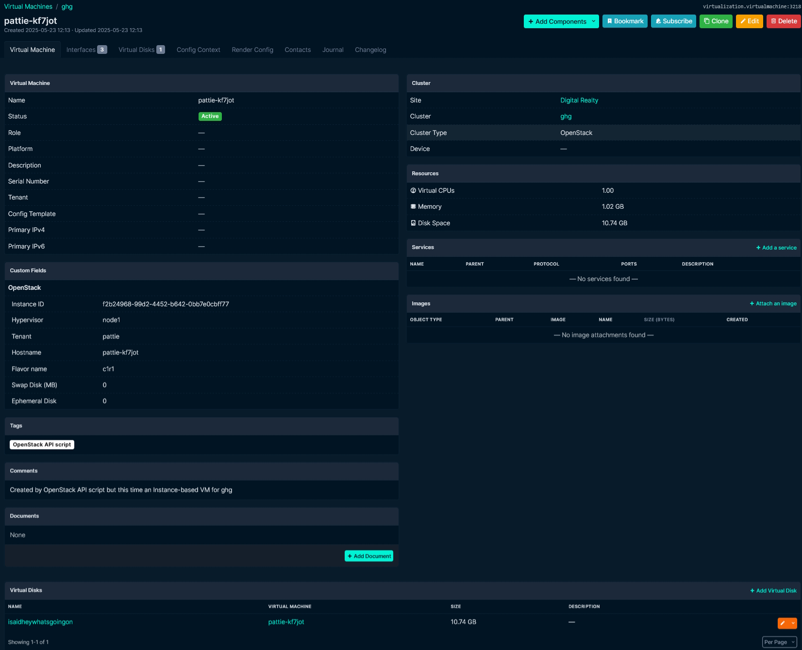
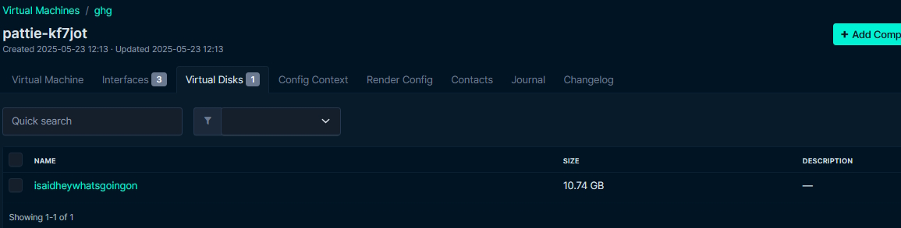
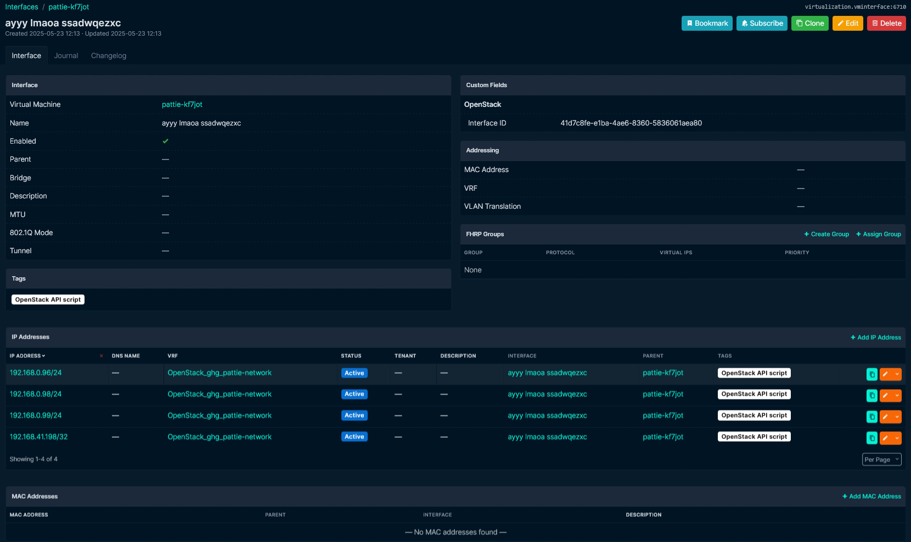
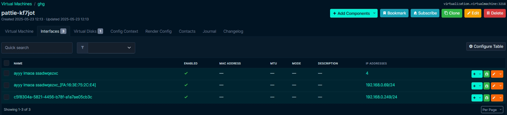
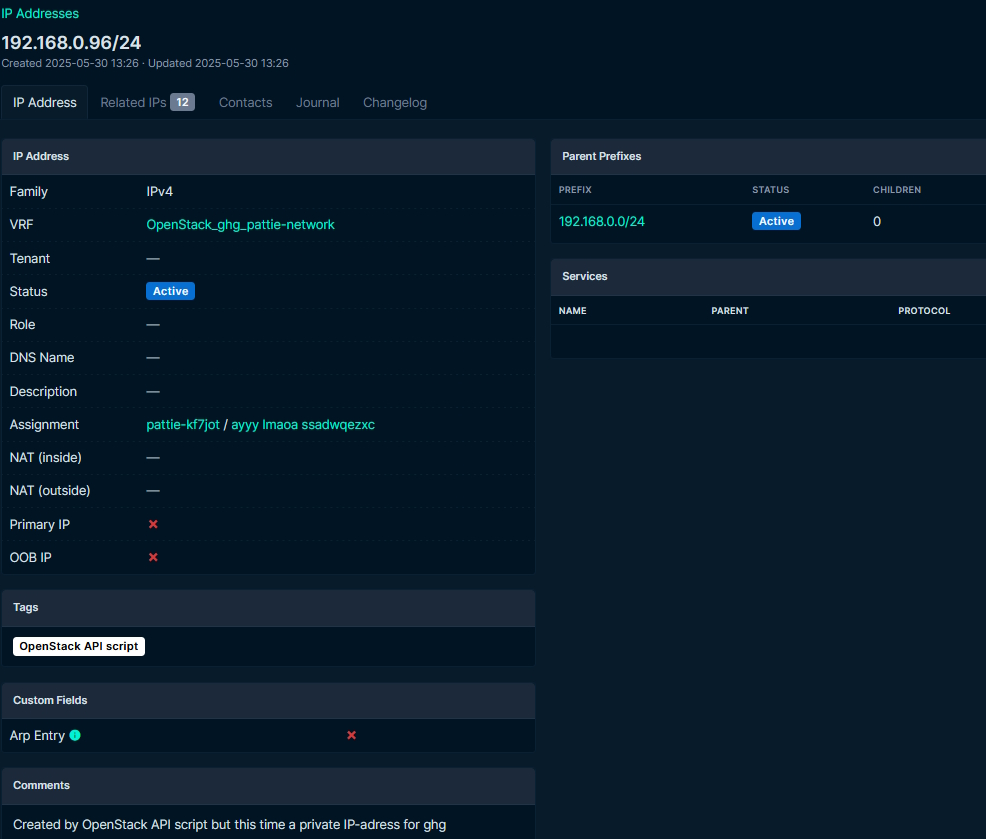
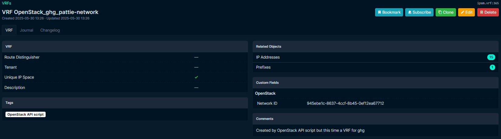
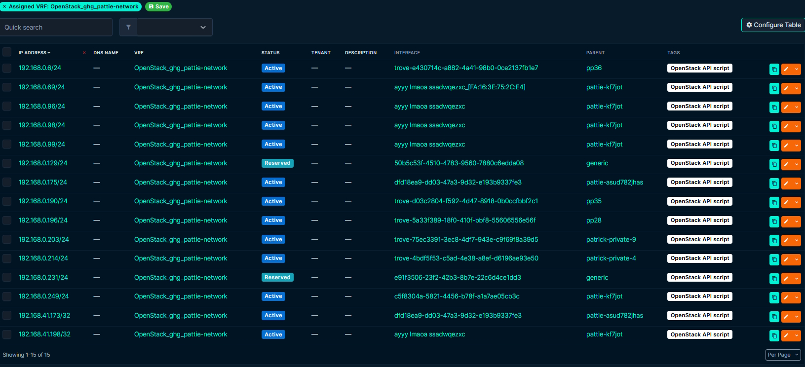
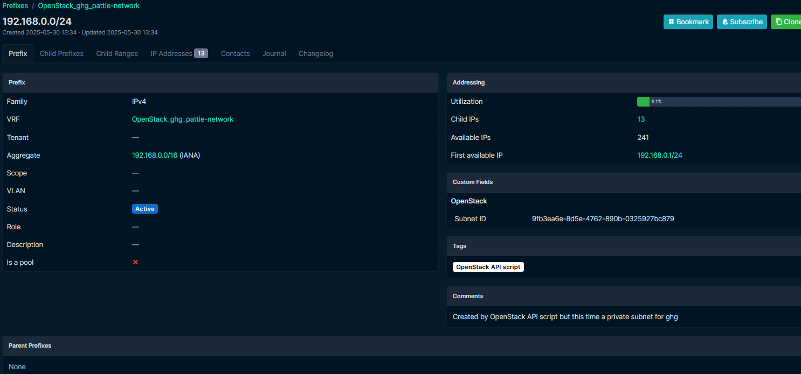

# OpenStack2NetBox
This script populates NetBox based on OpenStack Instances and its associations.
It adds NetBox Virtual Machines based on Instance-specific properties: Its Flavor, Volumes, Interfaces and IP-addresses.

Additionally, it adds NetBox Virtual Machines based on Neutron Routers and Neutron servers where DHCP-agents live.
WAN IP-addresses are added regardless of whatever they're attached to, 
whereas LAN IP-addresses are added, only if they are attached to a Nova Interface or a Router gateway.

The scripts are scoped to the following in NetBox:
- NetBox Virtualization: Virtual Machines, Interfaces and Virtual Disks;
- NetBox IPAM: VRFs, Subnets and IP addresses;
- NetBox Devices: MAC Addresses.

The `openstack-to-netbox.py` script calls the functions to populate NetBox. 
Whatever information the authenticated OpenStack user can get using the Nova, Neutron, Keystone and Cinder APIs, is whatever the script can work with. 
A Tenant-scoped user can only request Nova, Neutron and Cinder objects within that Tenant.
So a system-scoped user such as admin works best, as they can list everything, including admin-only properties.

This script aims to be unopiniated when it comes to manipulation of data.
There is no mapping of values from X to NetBox Tenancy, Roles, Names, Descriptions, etc.
In that sense it does the 'bare minimum' to create VMs in NetBox.
My philosophy being, if you can do it using an external script, it has no bearing being inside OpenStack2NetBox.

VRFs are generated only when there's an Interface with a LAN IP.
The VRF-name is generated based on the OpenStack network name the IP resides in.
You can change the NetBox VRF name to something else, but should at least keep the tag and ID(s).
LAN Prefixes are added within the VRF, or added/updated globally in case of WAN Subnets.
In case of a WAN IP-address, the IP is added to the Global VRF, or it is updated if it exists in this space already.

You may combine or 'merge' Neutron networks into specific NetBox VRFs by adding the relevant 
Neutron network ID to the proper Custom Field and the openstack-api-script tag to said VRF.
You should place a single "," in between Network IDs when combining multiple Neutron networks.
Delete the openstack-api-script tagged items in the 'old' VRF, then delete the old VRF itself 
(or otherwise remove the tag and Neutron ID from it) and re-run the script.
This will only work for 'LAN' VRFs, as we don't create VRFs to hold WAN objects.

This script can be re-run, and it'll update NetBox Objects with their latest states.

# Tested with:
| OpenStack         | NetBox | OpenStack2NetBox |
|-------------------|--------|------------------|
| Antelope, Caracal | v4.3.5 | v0.7.1+          |

# Requirements
Install git and python, clone the repo:
```
apt install git python3
git clone https://github.com/AskskwBv8T2nrm4Qnj/openstack2netbox.git
```

Create a virtual environment and prepare the requirements:
```
cd openstack2netbox/
python3 -m venv .venv
source .venv/bin/activate
pip install -Ur requirements.txt
cp .openstack-example.env .openstack.env
```

Now we collect values to fill `.openstack.env` with!

## OpenStack side
As an admin, you can find your (internal) Keystone auth url in:  
**OpenStack Horizon --> Admin --> System --> System Information**
```
os_auth_url="https://internal-openstack.example:5000/v3"
os_auth_url_type="internal"
```

As a regular user, you can find your (public) Keystone auth url in:  
**OpenStack Horizon --> Project --> API Access**
```
os_auth_url="https://openstack.example:5000/v3"
os_auth_url_type="public"
```

If you manage your OpenStack environment, you may want to create a new user rather than use your current one.  
**OpenStack web-interface --> Identity --> Users --> Create User**  
OpenStack Username goes into `os_username`, Password into `os_password` and Tenant into `os_project_name`.  
```
User Name: netbox
Password: xxx
Confirm Password: xxx
Role: xyz
Project: MyTenantName
```

## NetBox
Create a NetBox user and API Token, which the scripts will use to access NetBox.  
**Admin --> Users --> Add** 
```
Username: netboxopenstack
Status: Active, Staff status, Superuser status
```

**Admin --> API Tokens --> Add**  
Key goes into `netbox_token`
```
Username: netboxopenstack
Key: yyy
```

There are some resources you need to create manually, to fill `openstack.env` with:  
- **Virtualization --> Cluster Types --> Add**  
Name goes into `cluster_type_name`

- **Virtualization --> Clusters --> Add**  
Name goes into `cluster_name`

We add custom fields to NetBox, so we can populate them with values parsed by our script.  
**Customization --> Custom Fields --> Import**
```
name;type;object_types;search_weight;filter_logic;weight;label;group_name
openstack_id;text;virtualization.virtualmachine;750;loose;70;Instance ID;OpenStack
openstack_hypervisor;text;virtualization.virtualmachine;5000;loose;71;Hypervisor;OpenStack
openstack_tenant;text;virtualization.virtualmachine;5000;loose;72;Tenant;OpenStack
openstack_hostname;text;virtualization.virtualmachine;5000;loose;80;Hostname;OpenStack
openstack_flavor;text;virtualization.virtualmachine;5000;loose;91;Flavor name;OpenStack
openstack_swap;integer;virtualization.virtualmachine;5000;loose;92;Swap storage;OpenStack
openstack_ephemeral;integer;virtualization.virtualmachine;5000;loose;93;Ephemeral storage;OpenStack
openstack_interfaceid;text;virtualization.vminterface;5000;loose;90;Interface ID;OpenStack
openstack_networkid;text;ipam.vrf;5000;loose;90;Network ID;OpenStack
openstack_volumeid;text;virtualization.virtualdisk;5000;loose;90;Volume ID;OpenStack
openstack_subnetid;text;ipam.prefix;5000;loose;90;Subnet ID;OpenStack
```

We add a Tag, so we can filter for objects created by our script:  
**Customization --> Tags --> Import**
```
name;slug;color;description;id
OpenStack API script;openstack-api-script;ffffff;;
```

# Finally
Run the script:
```
python3 openstack-to-netbox.py
```

# Screenshots
<div >
 
 
 ">
 ">
</div>

<div >
 ">
 
 
 ">
</div>

# Considerations and lamentations
Script `openstack-to-netbox.py` is additive, meaning it will not delete data from NetBox.
Instead, you may use `scripts/tool_nb_cleanup_unused.py`, which will compare the state of OpenStack with the state of NetBox,
and will either filter for NetBox objects that are not held in an OpenStack service anymore,
or remove empty resources such as Subnets and VRFs.
It goes without saying, but ALWAYS configure your .openstack.env to point to the proper 
NetBox cluster and your OpenStack variables to the proper OpenStack cluster when running the clean-up script.

There is some compromise in naming scheme, as NetBox does not like object-types with the same names, being bound to the same object.
Such is the case for Virtual Disks and Interfaces bound to Virtual Machines,
but also for the same Virtual Machine name existing in the same Cluster without a Tenant applied.
In that case, the script will give a custom name to the object, the name includes the first portion of their OpenStack UUID.

It is hardcoded to skip APIPA and Loopback IP-addresses.

These scripts are extremely sys.exit happy. If your OpenStack database is inconsistent, 
i.e. Volume attachments to non-existent Instances, Interfaces attached to nothing, Objects in error status, etc.
These scripts won't be happy, but at least it'll give you some insight into what's weird with your OpenStack environment.

Floating IPs are added as a /32 for now, because I couldn't figure out a method to find their subnetmask.

Setting your NetBox Gunicorn config to restart after a high amount of requests, may prevent "502 Bad Gateway" from arising on the NetBox side.

# Disclaimer
See the `LICENSE.txt` file in the repository root

This is my first programming project. I made my first forays into programming early 2024 pls no bully ;_;

Created while employed at DirectVPS (https://directvps.nl) and studying at the Hogeschool Utrecht (https://www.hu.nl/).
Maybe like, order a VPS if this script gives you happy feelings ¯\\\_(ツ)_/¯

# To-do
- Adequately describe and scope required NetBox and OpenStack permissions?
- Use OpenStack tokens instead of a username + password combination?
- Better programming: logging, error-catching, best practices, PEP, less sys.exit, structured functions, etc?
- Include Octavia Load Balancers and Trove Database Instances?

# Other cool import plug-ins
You may also want to take a look at these cool NetBox scripts/plug-ins (not affiliated with OpenStack2NetBox):

- https://github.com/bonzo81/netbox-librenms-plugin/
- https://github.com/SRC-doo/netbox-ssot
- https://github.com/bb-Ricardo/netbox-sync
- https://github.com/netdevopsbr/netbox-proxbox/
