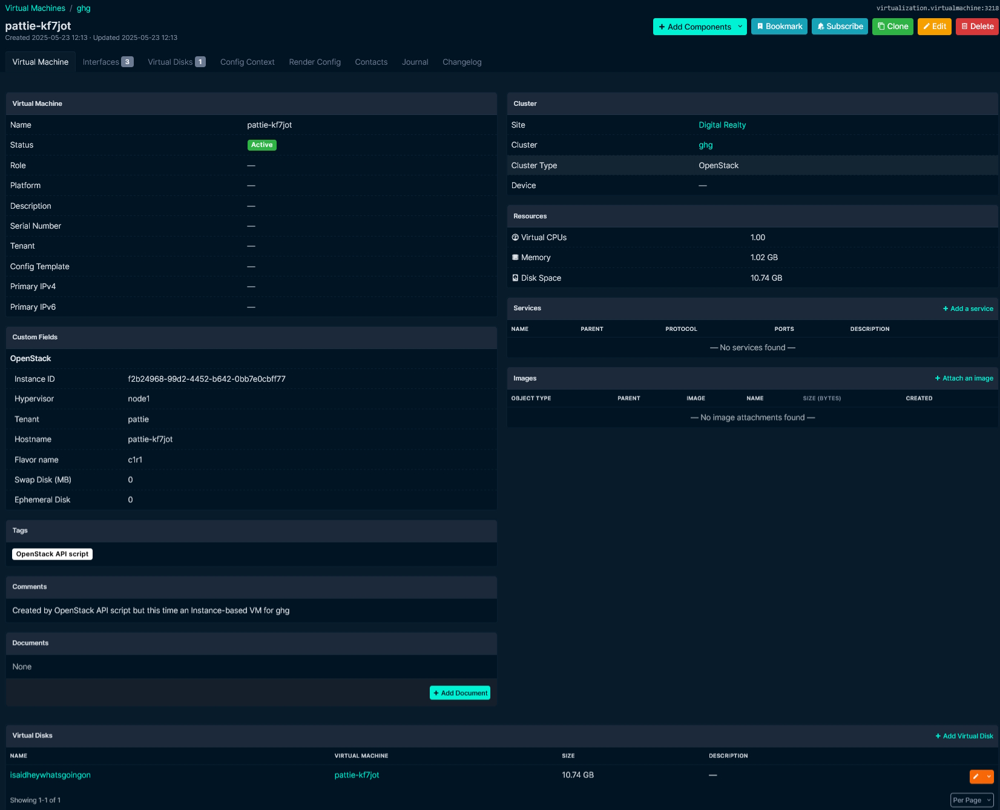
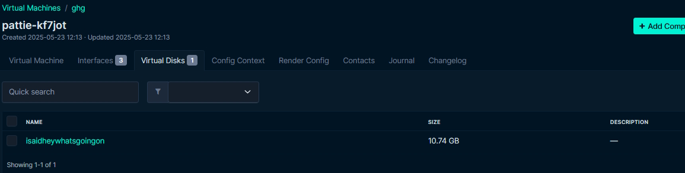
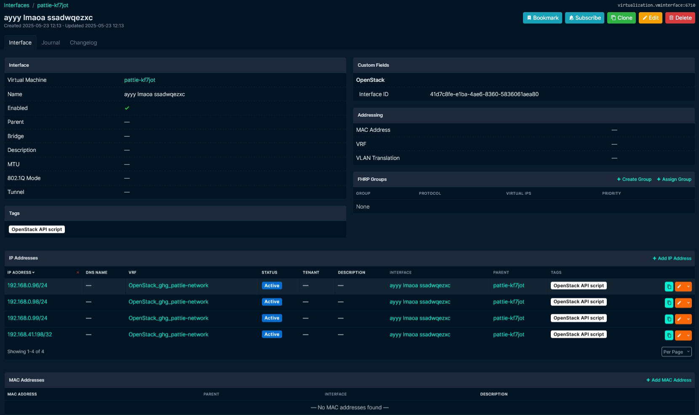
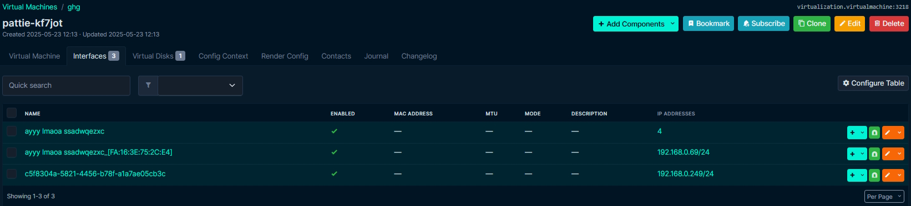
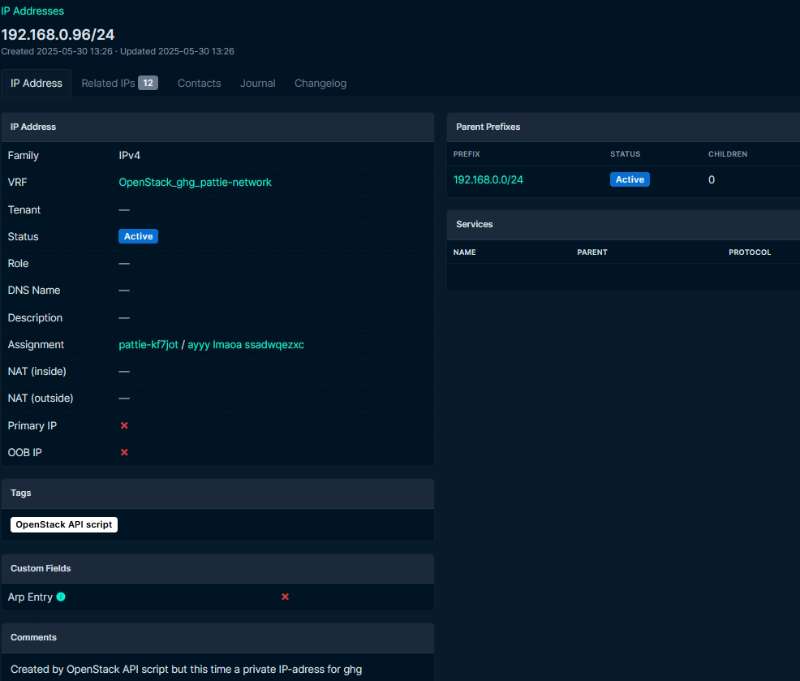
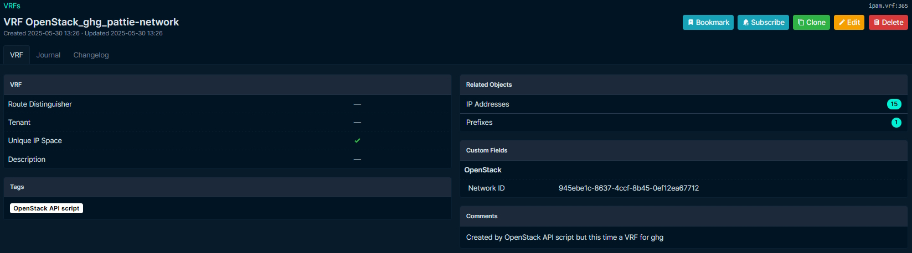
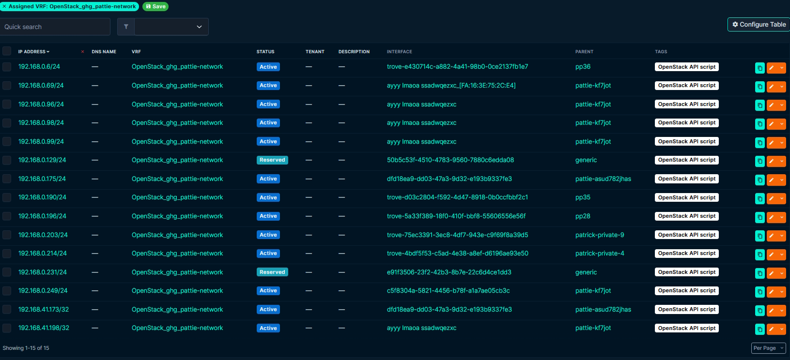
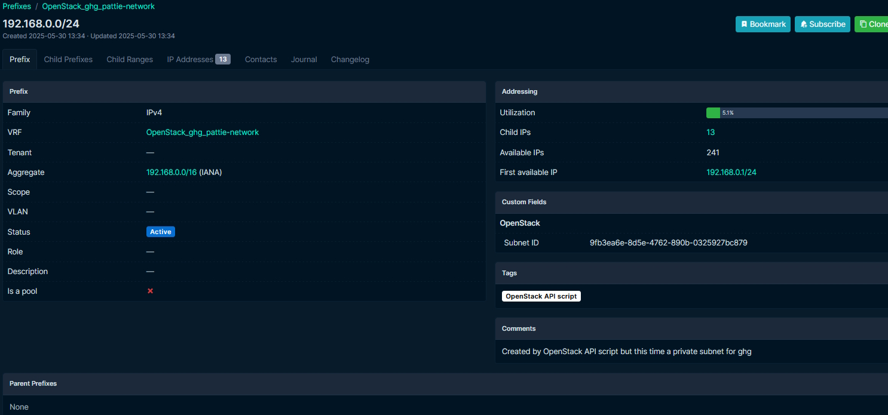

# OpenStack2NetBox
OpenStack2NetBox populates NetBox Virtual Machines based on OpenStack Instances and their most relevant properties: Flavors, Volumes, Interfaces and IP-addresses.
It also adds Neutron Routers and Neutron servers where DHCP-agents live. On rerun, it updates the NetBox objects with their latest states.

The tool works with information the authenticated OpenStack user has access to using the Nova, Neutron, Keystone and Cinder APIs. 
A system-scoped user with admin rights works best because they include admin-only properties.
A Tenant-scoped user can only request properties for that specific Tenant.

OpenStack2NetBox aims to be unopiniated when it comes to manipulation of data.
The main philosophy is to map data directly on a one-to-one basis and not to change values from X to Y while doing so. 
In a sense, it does the 'bare minimum' when creating VMs in NetBox.

LAN IP-addresses are added **only** when attached to a Nova Interface or Router gateway.
WAN IP-addresses are added to the global VRF, regardless of whatever they're attached to, 
A VRF is created when an interface with a LAN IP is found.
LAN Prefixes are added within said VRF and WAN Prefixes are added to the global VRF.
The LAN VRF name is generated based on the OpenStack network name the IP resides in.
You can change the NetBox VRF name to anything else, but you should keep the tag and ID(s).

You can 'merge' Neutron networks into specific NetBox VRFs by adding the relevant 
Neutron network ID to the Custom Field + the openstack-api-script tag.
Place a single "," between Network IDs when combining multiple Neutron networks.
As cleanup in the 'old' VRF, remove any openstack-api-script tagged items and the Neutron UUID and then delete the VRF. 
Re-run the script and the configured VRF will be populated instead.

The tool populates these NetBox categories:
- Virtualization: Virtual Machines, Interfaces and Virtual Disks;
- IPAM: VRFs, Subnets and IP addresses;
- Devices: MAC Addresses.

# Tested compatibility
| OpenStack         | NetBox | OpenStack2NetBox | Other                  |
|-------------------|--------|------------------|------------------------|
| Antelope, Caracal | v4.3.5 | v0.7.1           | Ubuntu 22, Python 3.8  |
| Antelope, Caracal | v4.6.7 | v0.7.2           | Ubuntu 24, Python 3.12 |

# Installation
Install git, python and clone the repo:
```
apt install git python3 python3-venv
git clone https://github.com/AskskwBv8T2nrm4Qnj/openstack2netbox.git
```

Create a virtual environment, install pip requirements, and copy the environment configuration file:
```
cd openstack2netbox/
python3 -m venv .venv
source .venv/bin/activate
pip install -Ur requirements.txt
cp .openstack-example.env .openstack.env
```


# Configuration
We prepare NetBox, OpenStack and collect values to fill `.openstack.env` with!

## NetBox
There are some resources you must create manually:  

Add custom fields:  
**Customization → Custom Fields → Import**
```
name;type;object_types;search_weight;filter_logic;weight;label;group_name
openstack_id;text;virtualization.virtualmachine;750;loose;70;Instance ID;OpenStack
openstack_hypervisor;text;virtualization.virtualmachine;5000;loose;71;Hypervisor;OpenStack
openstack_tenant;text;virtualization.virtualmachine;5000;loose;72;Tenant;OpenStack
openstack_hostname;text;virtualization.virtualmachine;5000;loose;80;Hostname;OpenStack
openstack_flavor;text;virtualization.virtualmachine;5000;loose;91;Flavor name;OpenStack
openstack_swap;integer;virtualization.virtualmachine;5000;loose;92;Swap storage;OpenStack
openstack_ephemeral;integer;virtualization.virtualmachine;5000;loose;93;Ephemeral storage;OpenStack
openstack_interfaceid;text;virtualization.vminterface;5000;loose;90;Interface ID;OpenStack
openstack_networkid;text;ipam.vrf;5000;loose;90;Network ID;OpenStack
openstack_volumeid;text;virtualization.virtualdisk;5000;loose;90;Volume ID;OpenStack
openstack_subnetid;text;ipam.prefix;5000;loose;90;Subnet ID;OpenStack
```

Add the Tag:  
**Customization → Tags → Import**
```
name;slug;color;description;id
OpenStack API script;openstack-api-script;ffffff;;
```

Create a NetBox user and API Token
**Admin → Users → Add** 
```
Username: netboxopenstack
Status: Active, Staff status, Superuser status
```

**Admin → API Tokens → Add**  
Key goes into `netbox_token`
```
Username: netboxopenstack
Key: nbt_xyzxyz.qweqweqwe
```

Create the Cluster  
**Virtualization → Cluster Types → Add**  
Name goes into `cluster_type_name`

**Virtualization → Clusters → Add**  
Name goes into `cluster_name`


## OpenStack
As an admin, you can find your (internal) Keystone auth url in:  
**OpenStack Horizon → Admin → System → System Information**
```
os_auth_url="https://internal-openstack.example:5000/v3"
os_auth_url_type="internal"
```

As a regular user, you can find your (public) Keystone auth url in:  
**OpenStack Horizon → Project → API Access**
```
os_auth_url="https://openstack.example:5000/v3"
os_auth_url_type="public"
```

You may want to create a new user rather than use your current one.  
**OpenStack Horizon → Identity → Users → Create User**  
OpenStack Username goes into `os_username`, Password into `os_password` and Tenant into `os_project_name`.  
```
User Name: netbox
Password: xxx
Confirm Password: xxx
Role: xyz
Project: MyTenantName
```

# Execution
Source the venv and run the script:
```
source .venv/bin/activate
python3 openstack-to-netbox.py
```

# Considerations and lamentations
OpenStack2NetBox does not delete objects from NetBox. For deleting objects use `scripts/tool_nb_cleanup_unused.py`.
It compares the state of OpenStack with the state of NetBox, deletes certain empty Subnets & VRFs and the NetBox objects that are not present in OpenStack services anymore.
Always make sure to point your .openstack.env values to the proper clusters when running the cleanup script!

Sometimes an object may be added with a custom-name because NetBox can't handle objects with duplicate names, being bound to the same object.
These custom names include a portion of the objects' OpenStack UUID.

The tool is hardcoded to skip APIPA and Loopback IP-addresses.

These scripts are extremely sys.exit happy. Your mileage will vary if your OpenStack database is inconsistent.
It may cause scripts fail on issues like Volume attachments to non-existent Instances and Interfaces attached to nothing.

Floating IPs are added as a /32 because I couldn't figure out an API method to identify their subnetmask.

Setting your NetBox Gunicorn config to restart after a high amount of requests, may prevent "502 Bad Gateway" from arising on the NetBox side.

RAM and Disk sizes are added as GiB. It is recommended to add the following values to NetBox's configuration.py
```
DISK_BASE_UNIT = 1024
RAM_BASE_UNIT = 1024
```

# Screenshots
<div>
 
 
 ">
 ">
</div>

<div>
 ">
 
 
 ">
</div>

# To-do list
- Adequately describe and scope required NetBox and OpenStack permissions?
- Use OpenStack tokens instead of a username + password combination?
- Better programming: logging, error-catching, best practices, PEP, less sys.exit, structured functions, etc?
- Include Octavia Load Balancers and Trove Database Instances?

# Other cool import plug-ins
You may also want to take a look at these cool NetBox scripts and plugins (not affiliated with OpenStack2NetBox):

- https://github.com/bl4ko/netbox-ssot/
- https://github.com/bonzo81/netbox-librenms-plugin/
- https://github.com/bb-Ricardo/netbox-sync

# Disclaimer
See the `LICENSE.txt` file in the repository root

This is my first programming project. I made my first forays into programming early 2024 pls no bully ;_;

This tool was created while employed at DirectVPS (https://directvps.nl) studying at the Hogeschool Utrecht (https://www.hu.nl/).
